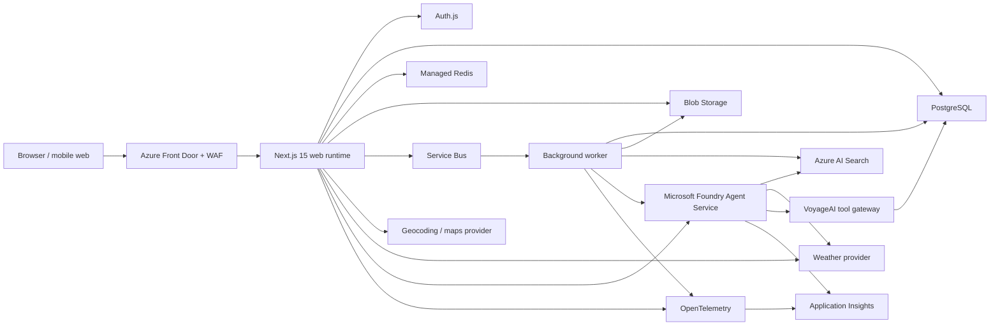

# System Architecture

## Product domains

VoyageAI is divided into the following business modules:

| Module | Responsibility |
|---|---|
| Identity | Accounts, sessions, consent, roles, profile and preferences |
| Trips | Trip lifecycle, dates, destinations, members and collaboration |
| Itinerary | Days, scheduled items, notes, ordering and conflicts |
| Places | Normalized destinations, places, geo-coordinates and saved places |
| AI Planning | Plan generation, refinement, explanations and tool execution |
| Weather | Forecast retrieval, normalization, caching and itinerary advisories |
| Knowledge | Source ingestion, chunking, embedding, indexing and citations |
| Collaboration | Invitations, comments, activity and optimistic concurrency |
| Billing | Plans, entitlements, usage and provider webhook state |
| Notifications | In-app and email delivery preferences and events |
| Operations | Auditing, moderation, feature flags, telemetry and support |

## Runtime topology

## Request paths

### Normal application request

1. Front Door applies TLS, WAF and edge controls.
2. Next.js authenticates the session and resolves tenant/user context.
3. A route handler or server action validates input.
4. An application service enforces authorization and business rules.
5. A repository performs the transaction.
6. Audit and domain events are recorded using an outbox entry in the same transaction.
7. The response returns a version/ETag for safe collaborative updates.

### AI planning request

1. The client creates an `ai_run` and receives a run identifier.
2. VoyageAI assembles a minimal trip context and starts a Foundry agent run.
3. The agent may invoke allow-listed tools for retrieval, weather, place lookup and trip reads.
4. Streaming progress is relayed to the browser through Server-Sent Events.
5. Structured output is validated against a versioned schema.
6. The proposed plan is saved as a draft, not written directly into the canonical itinerary.
7. The user reviews and explicitly applies the proposal.

### Background ingestion request

1. An admin or automated source creates a knowledge-source revision.
2. A Service Bus message starts ingestion.
3. The worker downloads, malware-scans, parses and normalizes content.
4. Content is chunked, embedded and indexed in a staging index.
5. Quality checks run before the active index alias is moved.
6. Source and index versions are persisted for citation traceability.

## Internal layering

Every domain follows the same dependency direction:

`transport → application use case → domain policy → repository/adapter`

- Transport: route handlers, server actions, webhooks and worker consumers.
- Application: transaction boundaries and orchestration.
- Domain: entities, value objects, authorization policies and invariants.
- Infrastructure: database, cache, Foundry, search, weather and storage adapters.

UI components never access Prisma, Foundry, weather providers or Azure SDKs directly.

## Consistency model

- Strong consistency: trip membership, itinerary edits, billing entitlements and security state.
- Transactional outbox: notifications, analytics, indexing and other asynchronous side effects.
- Eventual consistency: AI Search indexes, weather snapshots, activity feeds and aggregate analytics.
- Optimistic concurrency: mutable collaborative records carry an integer version.
- Idempotency: mutation APIs, webhooks and job consumers use persisted idempotency keys.

