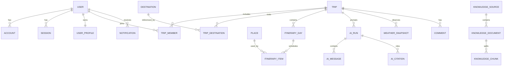

# Database Schema

## Database strategy

Use PostgreSQL as the transactional system of record. Use UUIDv7-compatible identifiers, UTC timestamps, `timestamptz`, soft deletion only where recovery is a product requirement, and row versions for collaborative entities.

Azure AI Search stores retrieval projections, never canonical records. Blob Storage stores file bytes; PostgreSQL stores metadata and ownership.

## Entity relationship overview

## Identity and access

### `users`

`id`, `email`, `email_normalized`, `email_verified_at`, `display_name`, `image_url`, `status`, `locale`, `timezone`, `created_at`, `updated_at`, `deleted_at`

Constraints: unique normalized email; status in `active`, `suspended`, `deleted`.

### `accounts`

Auth.js provider account records: `id`, `user_id`, `provider`, `provider_account_id`, encrypted token fields, token expiry, scopes and timestamps.

Unique: `(provider, provider_account_id)`.

### `sessions`

`id`, `session_token_hash`, `user_id`, `expires_at`, `ip_hash`, `user_agent_hash`, `created_at`, `last_seen_at`.

### `verification_tokens`

Hashed, single-use email verification and password-reset tokens with purpose and expiry.

### `user_profiles`

`user_id`, home airport, country, preferred units, default currency, accessibility needs, dietary preferences, travel pace and JSON preference extensions.

### `consents`

`id`, `user_id`, `type`, `policy_version`, `granted`, `captured_at`, `source`.

## Trips and collaboration

### `trips`

`id`, `owner_user_id`, `title`, `slug`, `status`, `visibility`, `start_date`, `end_date`, `timezone`, `currency`, `party_size`, `budget_amount`, `budget_currency`, `summary`, `cover_image_url`, `version`, `created_at`, `updated_at`, `archived_at`.

Status: `draft`, `planning`, `booked`, `in_progress`, `completed`, `archived`.

### `trip_members`

`id`, `trip_id`, `user_id`, `role`, `invitation_status`, `invited_email_normalized`, `invited_by`, `joined_at`, timestamps.

Role: `owner`, `editor`, `viewer`.  
Unique: `(trip_id, user_id)` when user is present.

### `trip_destinations`

`id`, `trip_id`, `destination_id`, `sequence`, `arrival_date`, `departure_date`, `notes`.

### `destinations`

`id`, `slug`, `name`, `country_code`, `region`, `city`, `latitude`, `longitude`, `timezone`, `geocoding_provider`, `provider_place_id`, `metadata_json`, timestamps.

### `places`

`id`, `destination_id`, `name`, `category`, `address`, geo-coordinates, timezone, provider identifiers, website, phone, price level, rating projection, opening-hours JSON, accessibility JSON, source freshness and timestamps.

Unique provider identity: `(provider, provider_place_id)`.

### `saved_places`

`id`, `user_id`, `place_id`, optional `trip_id`, `collection_name`, `notes`, timestamps.

### `trip_invitations`

`id`, `trip_id`, `email_normalized`, `role`, `token_hash`, `expires_at`, `accepted_at`, `revoked_at`, `invited_by`.

## Itinerary

### `itinerary_days`

`id`, `trip_id`, `local_date`, `destination_id`, `title`, `notes`, `sequence`, `version`, timestamps.

Unique: `(trip_id, local_date, sequence)`.

### `itinerary_items`

`id`, `itinerary_day_id`, `place_id`, `type`, `title`, `description`, `start_at`, `end_at`, `local_timezone`, `sequence`, `status`, `booking_reference_encrypted`, `cost_amount`, `cost_currency`, `location_json`, `source`, `ai_run_id`, `version`, timestamps.

Type: `activity`, `food`, `transport`, `lodging`, `flight`, `note`, `free_time`.  
Source: `user`, `ai`, `import`.

### `itinerary_item_dependencies`

Directed relationships such as transport-before-check-in: `item_id`, `depends_on_item_id`, `type`.

### `comments`

`id`, `trip_id`, optional itinerary target, `author_user_id`, `body`, `edited_at`, `resolved_at`, timestamps.

### `activity_events`

Append-only user-facing activity: actor, trip, event type, target type/id, safe metadata and timestamp.

## AI planning

### `ai_runs`

`id`, `user_id`, optional `trip_id`, `purpose`, `status`, `agent_name`, `agent_version`, `model_deployment`, `prompt_version`, `input_hash`, `structured_output_version`, token/latency/cost metrics, safety result, error code, `started_at`, `completed_at`, timestamps.

Status: `queued`, `running`, `requires_action`, `completed`, `failed`, `cancelled`.

### `ai_messages`

`id`, `ai_run_id`, `role`, `content_redacted`, `content_blob_uri`, `tool_name`, `tool_call_id`, `sequence`, token count, timestamp.

Sensitive raw content should use encrypted Blob Storage with short retention; the database keeps a redacted operational projection.

### `ai_plan_proposals`

`id`, `ai_run_id`, `trip_id`, `schema_version`, `proposal_json`, `status`, `validation_errors_json`, `applied_by`, `applied_at`, timestamps.

Status: `draft`, `valid`, `rejected`, `applied`, `expired`.

### `ai_citations`

`id`, `ai_run_id`, `knowledge_chunk_id`, `source_uri`, `source_title`, `retrieval_score`, `quote_start`, `quote_end`, `citation_label`.

### `ai_tool_executions`

`id`, `ai_run_id`, `tool_name`, `request_hash`, redacted request/response projections, status, latency, error code and timestamps.

## Weather

### `weather_locations`

Normalized provider-independent location key: `id`, coordinates, timezone, precision, provider mappings and timestamps.

### `weather_snapshots`

`id`, `weather_location_id`, optional `trip_id`, `provider`, `provider_request_id`, `forecast_generated_at`, `valid_from`, `valid_to`, normalized forecast JSON, units, confidence, `expires_at`, timestamps.

Index: location plus forecast validity. Retain short-term operational data only.

### `weather_advisories`

`id`, `trip_id`, optional itinerary item, severity, advisory type, title, explanation, recommended action, source snapshot, active interval, acknowledged metadata and timestamps.

## RAG and knowledge

### `knowledge_sources`

`id`, `name`, `kind`, `owner_scope`, optional destination/trip ownership, base URI, trust tier, ingestion policy, enabled state and timestamps.

Kind: `official_web`, `partner_feed`, `uploaded_document`, `editorial`, `trip_document`.

### `knowledge_documents`

`id`, `source_id`, `external_key`, `title`, `canonical_uri`, `blob_uri`, `mime_type`, `language`, checksum, publication/effective/expiry dates, ingestion status, parser version, current revision and timestamps.

Unique: `(source_id, external_key, current_revision)`.

### `knowledge_chunks`

`id`, `document_id`, `chunk_key`, `ordinal`, `content_redacted`, `content_hash`, token count, heading path, geo tags, category tags, ACL scope, effective dates, embedding model/version, search document key and timestamps.

Embeddings live in Azure AI Search; PostgreSQL stores lineage and indexing state.

### `knowledge_ingestion_jobs`

`id`, source/document, status, stage, attempt, idempotency key, parser/chunker/embedder/index versions, counts, errors and timestamps.

### `retrieval_logs`

`id`, `ai_run_id`, query hash, rewritten query projection, filters, index version, top-k, selected chunk IDs, latency and quality signals.

## Billing, notifications and operations

### `subscriptions`, `entitlements`, `usage_ledger`, `billing_events`

Provider-neutral billing projection. Webhook events retain provider event ID and processing status for idempotency.

### `notifications`, `notification_preferences`

Inbox state and channel preferences. Delivery attempts belong in a separate append-only table.

### `audit_logs`

Append-only security log: actor, action, resource, outcome, request/correlation ID, IP/user-agent hashes, safe metadata and timestamp.

### `idempotency_keys`

`scope`, `key_hash`, request hash, response reference/status, expiry. Unique on `(scope, key_hash)`.

### `outbox_events`

`id`, aggregate type/id, event type/version, payload, occurred time, publish status, attempts and lock metadata.

### `feature_flags`

Flag key, environment, rollout rules, enabled state and audit metadata.

## Data rules

- Tenant/trip authorization is enforced in application policies and covered by repository-level tests.
- Financial values use decimal amounts and ISO currency codes.
- Date-only trip boundaries stay as `date`; scheduled events use `timestamptz` plus IANA timezone.
- PII and booking references are encrypted using application-level envelope encryption backed by Key Vault.
- Logs never contain raw tokens, prompts, document contents or provider payloads.
- Hard-delete workflows fan out to Blob Storage, AI Search and caches through tracked erasure jobs.

