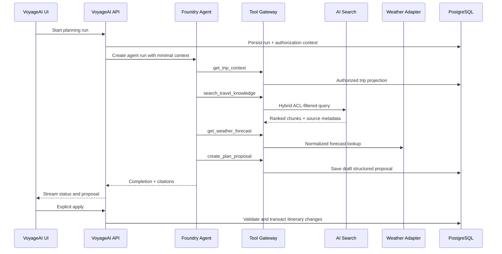
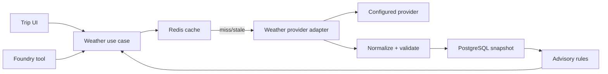

# Microsoft Foundry, Weather, and RAG Architecture

## Microsoft Foundry architecture

### Recommended production setup

Use a Microsoft Foundry project with managed identity and a production-oriented Standard Agent Setup when VoyageAI requires direct control of conversation files, retrieval storage and data residency. That setup connects the agent capability host to customer-managed Cosmos DB, Blob Storage and Azure AI Search.

For an initial lower-complexity environment, Basic Agent Setup is acceptable, but production data-control requirements should be decided before launch because setup choice affects storage ownership and networking.

### Agent topology

Use one planning agent with versioned instructions and narrow tools, rather than an unconstrained multi-agent system at launch.

| Component | Responsibility |
|---|---|
| Planning agent | Understand intent, decide tool sequence and produce structured proposals |
| Foundry model deployment | Reasoning and response generation |
| Embedding deployment | Knowledge and query embeddings |
| VoyageAI tool gateway | Authorization, validation and access to domain capabilities |
| Azure AI Search | Hybrid retrieval and security filtering |
| Foundry evaluations | Groundedness, relevance, safety, completeness and regression testing |
| Application Insights | Traces, latency, failures and correlated run telemetry |

### Planning flow

### Structured output

The agent returns a versioned plan proposal containing:

- Trip assumptions and unresolved questions.
- Per-day items with local times and timezones.
- Place/provider references where known.
- Travel-time buffers.
- Cost estimates with currency and confidence.
- Weather considerations.
- Accessibility and dietary considerations.
- Source citations.
- Warnings and validation results.

The application rejects malformed output, unknown schema versions, unauthorized resource references and proposals that violate hard trip constraints.

### Guardrails

- Treat retrieved content, uploaded documents and tool output as untrusted data.
- Keep system instructions outside user-controlled storage.
- Allow-list tools and validate every argument.
- Cap tool loops, runtime, tokens, retrieval results and output size.
- Redact PII before durable AI logging.
- Apply Azure content filters plus application-specific travel safety policies.
- Require confirmation before itinerary mutation, deletion, payment or outbound communication.
- Display freshness and source provenance for factual claims.
- Never present generated visa, border, health or emergency guidance as authoritative; direct users to official sources.

### Evaluation lifecycle

Maintain versioned evaluation datasets for:

- Single-city weekend plans.
- Multi-city and timezone transitions.
- Families, accessibility needs and dietary restrictions.
- Budget and luxury constraints.
- Bad weather and disrupted schedules.
- Conflicting, stale and malicious source documents.
- Sparse destinations and retrieval misses.
- Citation correctness and unsupported claims.

Release gates should cover groundedness, itinerary validity, citation precision, tool success rate, policy compliance, latency and cost.

## Weather integration architecture

### Provider abstraction

Define one internal weather contract and implement providers behind it. Provider payloads never reach UI or domain code directly.

Normalized capabilities:

- Resolve weather location from coordinates.
- Current conditions.
- Hourly forecast.
- Daily forecast.
- Severe weather alerts.
- Historical/climatology fallback where licensed.
- Provider freshness, confidence and attribution.

### Request flow

### Cache policy

- Current conditions: short TTL.
- Near-term hourly forecast: short-to-medium TTL.
- Later daily forecast: medium TTL.
- Historical/climatology: long TTL when licensing permits.
- Use stale-while-revalidate for user experience.
- Deduplicate refreshes by normalized geospatial key and forecast window.
- Persist provider attribution and generation time.

### Itinerary-aware advisories

Rules compare forecast windows with itinerary items:

- Precipitation versus outdoor activity.
- Temperature and UV risk.
- Wind versus exposed or marine activities.
- Severe alert overlap.
- Forecast confidence and age.
- Travel disruption risk.

Rules produce explainable advisories; the AI may phrase them but does not invent the underlying severity.

### Failure strategy

Return the last valid snapshot with an explicit stale marker. If no forecast exists, return a typed unavailable state. Use circuit breakers, bounded retries, provider quota monitoring and a secondary provider only if licensing and normalization tests are in place.

## RAG architecture

### Knowledge scopes

| Scope | Examples | Access |
|---|---|---|
| Global trusted | Tourism boards, airports, transit agencies | All users |
| Curated editorial | VoyageAI destination guides | All entitled users |
| Partner | Licensed travel feeds | Contract/plan dependent |
| Trip private | User uploads, confirmations and notes | Trip members only |
| User private | Preferences and saved material | Owning user only |

### Ingestion pipeline

```mermaid
flowchart LR
    SRC["Source / upload"] --> REGISTER["Register revision"]
    REGISTER --> SCAN["Malware + type validation"]
    SCAN --> PARSE["Parse + OCR if allowed"]
    PARSE --> CLEAN["Normalize + remove boilerplate"]
    CLEAN --> CLASSIFY["Language, geography, category, trust"]
    CLASSIFY --> CHUNK["Structure-aware chunking"]
    CHUNK --> EMBED["Foundry embeddings"]
    EMBED --> STAGE["Staging search index"]
    STAGE --> QA["Coverage + retrieval QA"]
    QA --> ALIAS["Promote index alias"]
```

### Chunk metadata

Each search document includes:

- Stable chunk and document IDs.
- Source title and canonical URI.
- Source/revision checksum.
- Publication, effective and expiry dates.
- Language, country, region, city and coordinates where relevant.
- Topic/category and heading path.
- Trust tier.
- User/trip ACL filters.
- Embedding model and index schema versions.

### Retrieval pipeline

1. Classify intent and required freshness.
2. Rewrite the query without losing user constraints.
3. Apply ACL, geography, language, date and source-trust filters.
4. Run hybrid BM25 and vector search.
5. Apply semantic ranking/reranking.
6. Diversify by source and remove near-duplicates.
7. Enforce a relevance threshold; abstain if evidence is weak.
8. Package bounded context with citation IDs.
9. Generate an answer or proposal.
10. Verify that factual claims map to cited chunks.

### Index design

Use separate indexes or strict scope partitions for:

- Public destination knowledge.
- Licensed partner knowledge.
- Private user/trip documents.

This reduces ACL mistakes and supports separate retention and scaling policies. Use blue/green indexes with aliases for schema and embedding migrations.

### Prompt-injection defense

- Mark all retrieved text as evidence, not instruction.
- Strip active content and unsafe file types.
- Detect instruction-like passages and lower trust or quarantine.
- Never expose secrets or broad tools to the model.
- Keep authorization filters outside model control.
- Log source IDs involved in suspicious runs for investigation.

## Official architecture references

- [Microsoft Foundry hosted agents](https://learn.microsoft.com/azure/ai-foundry/agents/concepts/hosted-agents?view=foundry)
- [Microsoft Foundry agent runtime components](https://learn.microsoft.com/azure/ai-foundry/agents/concepts/runtime-components?view=foundry)
- [Standard Agent Setup](https://learn.microsoft.com/en-us/azure/foundry/agents/concepts/standard-agent-setup?view=foundry)
- [Capability hosts and setup types](https://learn.microsoft.com/en-us/azure/ai-foundry/agents/concepts/capability-hosts?view=foundry)

